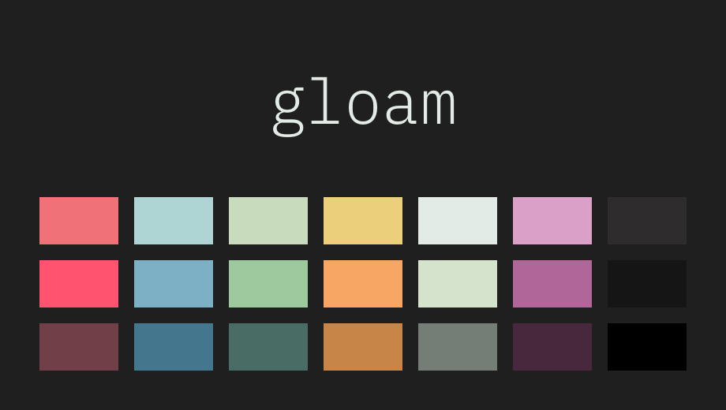

# 🎨 Gloam



A cool, moody colorscheme ,
(generated by [Estilo](https://github.com/jacoborus/estilo)).

## Table of contents

* [Gloam](#-gloam)
  * [Table of Contents](#table-of-contents)
  * [Prior Art](#prior-art)
  * [Installation](#installation)
  * [Roadmap](#roadmap)
  * [Contibuting](#contibuting)
  * [License](#license)

## Prior Art

Gloam is heavily based on two of my favorite colorschemes,
[tender](https://github.com/jacoborus/tender.vim) and
[Greenery](https://marketplace.visualstudio.com/items?itemName=jaredkent.greenery).
In fact, it’s essentially a palette swap of tender, using most of the
Greenery colors.

## Installation

Install manually, or using the package manager of your choice:

```viml
" vim-plug
Plug 'ngscheurich/gloam.vim'

" NeoBundle
NeoBundle 'ngscheurich/gloam.vim'

" Vundle
Plugin 'ngscheurich/gloam.vim'
```

Once installed, set the colorscheme in your `.vimrc` or `init.vim`:

```viml
" Vim >=8.0 or Neovim >= 0.1.5
if (has("termguicolors"))
 set termguicolors
endif

" Neovim 0.1.3 and 0.1.4
let $NVIM_TUI_ENABLE_TRUE_COLOR=1

# Enable syntax highlighting and set colorscheme
syntax enable
colorscheme gloam
```

You can use the included [airline](https://github.com/vim-airline/vim-airline)
theme like:

```viml
let g:airline_theme = 'gloam'
```

Fix for MacVim ([see issue](https://github.com/jacoborus/tender.vim/issues/9)):

```viml
let macvim_skip_colorscheme = 1
```

## Roadmap

I plan to add aditional syntax themes for some of the languages I work
in frequently, including:

* [] Elixir
* [] Lua
* [] GDScript

## Contributing

Want to contribute? Awesome! Contributions are always welcome—just be sure to
read and follow the [code of conduct](https://github.com/ngscheurich/gloam.vim/blob/master/CODE_OF_CONDUCT.md).

## License

This project is released under the [MIT license](https://github.com/ngscheurich/gloam.vim/blob/master/LICENSE).
